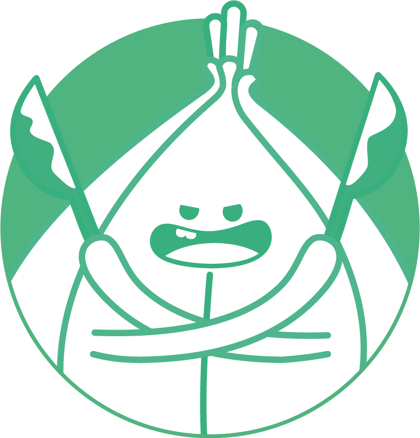
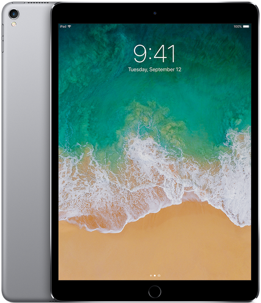
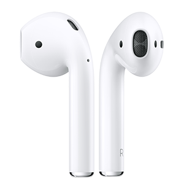

<h1 align="center">Pycon 2018 x Banksalad Holdem</h1>

<p align="center">
  
</p>

<p align="center">
  <a href="https://rainist.com/recruit">
    
  </a>
</p>

- 뱅크샐러드 홀덤
  - 뱅크샐러드 홀덤은 기존의 텍사스 홀덤에서 몇 가지 규칙을 변경하여 구현되었습니다.
  - 5명의 플레이어가 하나의 게임에 참여하여 플레이하게 되며, 2명의 플레이어가 남거나 100라운드가 끝났을 경우 한 경기가 끝나게 됩니다. (경기 종료 규칙 TBD)

## Prize

<p align="center">
  
</p>
<h3 align="center">1등 / iPad Pro 10.5"</h3>

<p align="center">
  
</p>
<p align="center">2등 / AirPods</p>

<p align="center">3등 / Starbucks 상품권</p>

## Submission

- **2018년 8월 19일 일요일 오후 4시까지** 제출된 코드에 대해서만 참여자격이 부여됩니다.
- 작성하신 코드를 [GitHub Gist](https://gist.github.com/)에 업로드 하신 후, [여기](https://goo.gl/forms/v4Nup2q7kgBlmmUh1)에 업로드 된 Gist 링크를 제출해주세요.
- 결승전과 시상식은 8월 19일 오후 5시에 OST룸에서 진행될 예정입니다.

## Rule

### 게임의 진행

> 게임의 진행은 일반적인 텍사스 홀덤과 비슷합니다.
>
> 뱅크샐러드 홀덤에서는 라운드마다 무작위로 선정된 플레이어부터 게임을 시작하게 됩니다.
>
> 모든 사용자가 접을 경우 판돈은 사라집니다.

1. 게임에 참여한 플레이어는 2장의 카드를 받고 베팅을 합니다.
2. 3장의 커뮤니티 카드가 오픈되고 베팅을 합니다.
3. 1장의 턴 카드가 오픈되고 베팅을 합니다.
4. 1장의 리버 카드가 오픈되고 베팅을 합니다.
5. 남은 플레이어가 공통으로 오픈된 5장의 카드와 손 패를 비교하여 순위를 매깁니다.

### 용어

- 핸드(hands) : 플레이어의 손에 있는 2장의 카드
- 커뮤니티 카드(community cards) : 공통으로 열리는 맨 처음의 3장의 카드
- 턴 카드(turn card) : 2번째로 열리는 1장의 카드
- 리버 카드(river card) : 마지막으로 열리는 1장의 카드

### 베팅 조건

- 참여비 (TBD)
- 최소 판돈 (TBD)
- 뱅크샐러드 홀덤에서는 자기 차례에 콜, 레이즈를 할 수 있으며 선으로 뽑힌 플레이어부터 판돈을 제시하고 다른 플레이어들에게 돌아가며 제시된 판돈에 대해 콜을 할지, 레이즈를 할지 정하게 됩니다.
  - 콜을 할 경우 다른 플레이어로 순서가 넘어갑니다.
  - 레이즈를 할 경우, 해당 플레이어를 기준으로 한 바퀴를 다시 돌게 됩니다.
- 올인 (TBD)

### 뱅크샐러드 홀덤 족보

> 높은 순서대로 나열되어 있습니다.

#### 로열 플러시

<br></img></img></img></img></img>

#### 스트레이트 플러시

<br></img></img></img></img></img>

#### 포카드

<br></img></img></img></img>

#### 풀하우스

<br></img></img></img></img></img>

#### 플러시

<br></img></img></img></img></img>

#### 스트레이트

<br></img></img></img></img></img>

#### 트리플

<br></img></img></img><br>
</img></img></img>

#### 투 페어

<br></img></img>
</img></img><br>
</img></img>
</img></img>

#### 원 페어

<br></img></img><br>
</img></img>

#### 탑

<br></img></img></img></img></img>

### 같은 족보일 경우의 판단

- 로열 플러시가 두벌 이상 나왔을 경우에는 _(거의 불가능한 확률)_ **스페이드 > 다이아몬드 > 하트 > 클로버** 순으로 높은 패로 인정됩니다.
- 로열 플러시가 아닌 경우에는 패가 만들어진 카드 중 가장 높은 숫자만을 비교합니다.
- 숫자를 비교하여 같은 숫자인 경우, 그 판은 무효가 되며 판돈은 딜러가 가져갑니다.

## How to play

`example.py` 의 `always_bet(...)` 함수를 참고하여 `turn.py` 의 `bet(...)` 함수를 수정하여 Pull Request 를 보내시면 됩니다.

```
def bet(
    my_chips: int,
    my_cards: List[Card],
    bet_players: List[Other],
    betting_players: List[Other],
    community_cards: List[Card],
    min_bet_amt: int,
    max_bet_amt: int,
    total_bet_amt: int
) -> int:
    pass
```

`0`을 `return` 하게 되면 해당 턴은 포기(`die`)한다는 의미입니다.

### Parameters

- my_chips: 남은 칩 수
- my_cards: 플래이어의 손 패 (2장)
- bet_players: 이번 턴에 배팅한 플레이어들
- betting_players: 아직 배팅하지 않은 플레이어들
- community_cards: 커뮤니티 카드 + 턴 카드 + 리버 카드 (3장~5장)
- min_bet_amt: 가능한 최소 배팅액
- max_bet_amt: 가능한 최대 배팅액
- total_bet_amt: 여태까지 배팅한 누적 금액

### Test

작성한 코드를 테스트 하려면, `__main__.py` 에서 `example.always_bet` 대신 `turn.py` 의 `bet` 함수를 `import` 하고 테스트 해보시면 됩니다

## Questions?

[Issue](https://github.com/Rainist/pycon-2018-banksalad-holdem/issues)를 활용해주시거나, 뱅크샐러드 부스를 방문해주세요 😎
